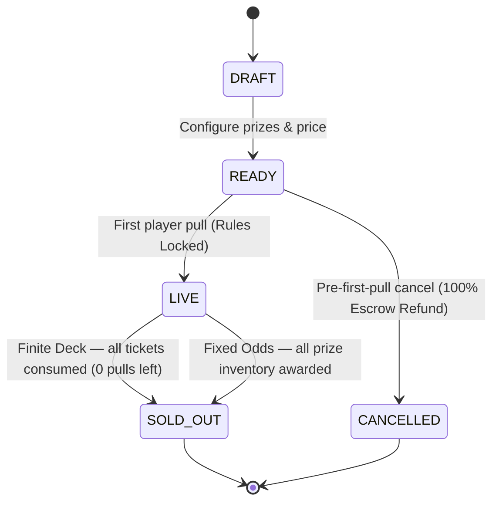

# RARE ARCADE — Economy & Mathematical Specification

## 1. Executive Summary
Rare Arcade is a creator-owned prize-machine marketplace powered by **$RAREFRIENDS (RF)**.
In this simulated Vibeathon MVP, all token deposits, prize escrow, NFT funding, and burn events are strictly simulated. No live contracts or real funds are handled. **NFT ownership, however, is genuinely verified**: creators can only fund Rare Friends Genesis / Generations NFTs their connected wallet holds (OpenSea discovery + fresh on-chain `ownerOf` reads on Robinhood Chain, chain ID 4663).

Every pull executes a fixed **5% platform burn**, with the remaining **95% credited to the machine creator/operator**.

---

## 2. Fundamental Units & Precision
To prevent JavaScript IEEE-754 floating-point drift:
- **Internal RF Scale**: `1 RF = 1000 internal units` (`0.001 RF` resolution).
- **Basis Points (BPS)**: `10000 BPS = 100.00%` (`1 BPS = 0.01%`).
- **Platform Burn BPS**: `500 BPS = 5.00%` (`BURN_BPS = 500n`).
- **Creator Proceeds BPS**: `9500 BPS = 95.00%` (`CREATOR_BPS = 9500n`).

### Exact Pull Split Conservation Invariant
For any pull price $P$:
$$\text{BurnUnits} = \left\lfloor \frac{P \times 500}{10000} \right\rfloor$$
$$\text{CreatorUnits} = P - \text{BurnUnits}$$
$$\text{BurnUnits} + \text{CreatorUnits} \equiv P \quad (\forall P > 0)$$

---

## 3. Prize Valuation & Escrow Model
Machines support three classes of tickets:
1. **RF Prizes**: Actual simulated RF amounts (e.g. 5,000 RF, 25,000 RF, 100,000 RF).
2. **NFT Prizes**: AUTOMATIC top-bid value in RF for a wallet-verified
   NFT actually held by the creator's connected wallet (any supported
   collection — Rare Friends Genesis/Generations remain pinned first).
    > *Top-bid reference for machine math — NOT a guaranteed market value. Rare
    > Arcade values NFT prizes automatically from the collection's top OpenSea bid;
    > creators never type an NFT's RF value during normal creation.*
3. **Try Again (No Prize)**: Reference value = $0\text{ RF}$.

### Total Reference Prize Value ($V$)
$$V = \sum_{i} \left( \text{quantity}_i \times \text{referenceValue}_i \right)$$

### Seeding Escrow
Upon publishing:
- Creator balance is deducted for the sum of all seeded simulated RF prizes.
- Seeded Rare Friends are moved from Creator's Owned inventory into Machine Escrow.

---

## 4. Expected Value (EV) & Return to Player (RTP)

### Initial EV per Pull
$$\text{EV}_{\text{initial}} = \frac{V}{\text{TotalPulls}}$$

### Player RTP (in BPS)
$$\text{RTP}_{\text{BPS}} = \left\lfloor \frac{\text{EV}_{\text{initial}} \times 10000}{P} \right\rfloor$$

### Modeled Operator Margin
$$\text{OperatorMargin}_{\text{BPS}} = 9500 - \text{RTP}_{\text{BPS}}$$
- Example 1: At $90\%$ RTP, Operator Margin $= 95\% - 90\% = 5\%$.
- Example 2: At $95\%$ RTP, Operator Margin $= 95\% - 95\% = 0\%$.
- Example 3: At $110\%$ RTP (creator-subsidized), Operator Margin $= 95\% - 110\% = -15\%$.

## 4b. Custom RTP (presets are suggestions, not restrictions)
Quick picks `80% / 85% / 90% / 95%` remain; CUSTOM accepts any positive finite
percentage with decimals (e.g. `72.5%`, `107.5%`, `125%`), stored exactly as
integer basis points (`72.5% = 7250 bps`). Only a generous technical cap
(`100000 bps = 1000%`) guards pathological input.
- **RTP > 95%** → PLAYER-FAVORABLE ECONOMICS warning (prize value exceeds
  post-burn receipts). Allowed.
- **RTP > 100%** → CREATOR-SUBSIDIZED MACHINE label with negative margin. Valid
  for promotions/giveaways. Allowed.
- **Very low RTP (< 50%)** → unmistakable preview; players see it publicly. Allowed.
- Target vs Actual RTP are both shown (integer tickets make them differ slightly).

---

## 5. Target RTP Solver & Recommended Ticket Count
When a creator chooses a pull price $P$, target RTP $R_{\text{target}}$ (default $90\%$), and seeds prizes with total value $V$:
$$\text{TargetEV} = \frac{P \times R_{\text{target}}}{10000}$$
$$\text{RecommendedPulls} = \max\left(\text{TotalPrizeItemCount}, \left\lfloor \frac{V + \frac{\text{TargetEV}}{2}}{\text{TargetEV}} \right\rfloor \right)$$

Because ticket counts are discrete integers:
- The UI exposes both **Target RTP** and **Actual Initial RTP**.
- No product RTP guardrails: any positive finite RTP is publishable (V1's
  75–95% restriction removed; `MIN/MAX_ALLOWED_RTP_BPS` deprecated, unenforced).

## 5b. Demo RF Scale (low-unit-value token calibration)
`src/domain/demoEconomy.ts` centralizes all demo suggestions (math unchanged):
- Pull-price picks: `1,000 / 2,500 / 5,000 / 10,000 RF` (default `2,500`).
- RF-prize picks: `5,000 / 10,000 / 25,000 / 50,000 / 100,000 RF` + custom.
- Player start: `250,000 RF` (simulated). Creator start: `2,500,000 RF` (simulated).
- Seeded fixtures: RF RAIN (1,000/pull × 100, 90.0%), FRIEND FRENZY (5,000/pull
  × 100 with real Generations #8283 @ 250,000 RF ref, 90.0%), HIGH ROLLER
  (10,000/pull × 30 with real Genesis #773 @ 150,000 RF ref, 90.0%).
- Display: thousands-grouped exact values (`2,500,000.00 RF`); compact
  (`2.5K/250K/2.5M RF`) only where space is tight, exact on details.

---

## 6. Dynamic Finite Inventory & Current RTP
Friend Machines have finite supply (e.g. 50 pulls). Each pull removes exactly one ticket from the shuffled deck.
At any point with $N_{\text{rem}}$ tickets remaining and $V_{\text{rem}}$ prize value remaining:
$$\text{EV}_{\text{current}} = \frac{V_{\text{rem}}}{N_{\text{rem}}}$$
$$\text{RTP}_{\text{current}} = \left\lfloor \frac{\text{EV}_{\text{current}} \times 10000}{P} \right\rfloor$$

> **Compelling Dynamic**: If high-tier prizes survive into the late stages of a machine, $\text{RTP}_{\text{current}}$ can rise significantly above $100\%$, creating natural player interest without deceptive odds.

---

## 7. Machine Lifecycle & State Invariants

### Immutable Rules Lock
- Before the first pull (`pullCount === 0`), a creator can cancel the machine. All seeded RF escrow and Rare Friends are returned immediately.
- Upon the **very first pull**, `isRulesLocked` becomes `true`.
- The creator cannot alter:
  - Pull price
  - Total ticket count
  - Prize inventory
  - Burn rate (fixed at 5%)
- Sold-out machines reject any further pulls.

---

## 8. Verifiable Randomness & Deck Construction
- The finite ticket deck contains exactly $\text{TotalPulls}$ tickets.
- Web Crypto API (`crypto.getRandomValues`) powers the Fisher-Yates shuffle during production/demo execution.
- Deterministic seeded PRNG (Mulberry32) is provided for automated invariant test suites.
- Odds are transparently displayed and recalculate live after each pull:
  $$\text{Probability}_i = \frac{\text{RemainingQuantity}_i}{N_{\text{rem}}}$$
  The sum of all displayed probabilities is guaranteed to equal $100.00\%$.

---

## 9. Fixed Odds Model

A Fixed Odds machine has **no ticket deck and no play cap**. Each pull rolls
fresh independent randomness against immutable per-prize probabilities.

### Probability precision
Probabilities are stored as integer **parts-per-million** (`1,000,000` = 100%),
supporting granularity down to `0.001%` with zero binary float drift.

### Fixed Odds probability
For prize slot $i$ with configured width $w_i$ ppm, every pull resolves:
$$\text{P(award } i) = \frac{w_i}{1{,}000{,}000}\quad\text{(while quantity remains)}$$

### No-prize odds
$$\text{NoPrize}_{\text{base}} = 1{,}000{,}000 - \sum_i w_i$$
$$\text{NoPrize}_{\text{effective}} = \text{NoPrize}_{\text{base}} + \sum_{\text{sold-out }j} w_j$$

### Sold-out slot behavior
When a prize's quantity reaches zero, its configured $w_i$ is **retained** and
rolls landing in its interval become empty outcomes. Other prizes' odds never
change; intervals are never rebuilt.

### Sellout condition
$$\text{SOLD\_OUT} \iff \text{all RF + Friend remaining quantities} = 0$$

### Configured RTP (never changes)
$$\text{EV}_{\text{configured}} = \frac{\sum_i \text{refVal}_i \times w_i}{1{,}000{,}000}$$
$$\text{RTP}_{\text{configured}} = \left\lfloor \frac{\text{EV}_{\text{configured}} \times 10000}{P} \right\rfloor$$

### Live Available RTP (inventory depletion, not rebalancing)
Same formula restricted to prizes with remaining quantity $> 0$. Decreases as
prizes sell out.

### Creator post-burn edge
$$\text{Edge} = 95\% - \text{RTP}_{\text{configured}}$$
(negative = creator-subsidized/promotional machine).

### Realized payout ratio (at completion only — never "RTP mid-run")
$$\text{Realized} = \frac{\text{reference value actually distributed}}{\text{total RF spent}}$$
Varies with luck: the pull count required to exhaust inventory is random.

### Lifetime modeling
Seeded Monte Carlo over independent-pull lifetimes estimates median/P25/P75
pulls to sellout, median volume/burn/receipts/net, early-sellout (p10 net)
and long-tail (p90 pulls) scenarios. Labeled MODELED/SIMULATED ESTIMATE —
never a guarantee.

---

## 10. Fundamental Fixed Odds Disclosure

It is impossible to have all three of:

1. finite prize inventory
2. individual prize odds that never change
3. constant live RTP after prizes sell out

without either changing remaining prize odds, replenishing inventory, or
replacing exhausted outcomes with something of equal value.

Rare Arcade chooses **FIXED INDIVIDUAL ODDS**: sold-out prize probability
becomes an empty result. This preserves the core promise honestly.

---

## 11. Future: Optional Restock Model (deferred)

Creators could keep a Fixed Odds machine running indefinitely by adding
inventory to an EXISTING prize slot at the SAME configured odds (RF only;
NFT slots stay unique-token). Restocking must never change probabilities.
Not implemented in this pass — documented here as the designed future path.

---

## 12. NFT Valuation Pipeline (automatic top-bid model)

**Market data source:** OpenSea API v2 (read-only, client-side).

- Wallet inventory: `GET /api/v2/chain/{chain}/account/{address}/nfts`
  across a controlled chain registry (discovered via `GET /api/v2/chains`,
  priority chains first, concurrency ≤ 4, paginated, 45s cache).
- Ordinary NFT USD reference: the **collection's top bid in USD** — the max
  ACTIVE offer from `GET /api/v2/offers/collection/{slug}` (client-side max;
  endpoint is unsorted, up to 3 pages scanned; 3min cache, deduped per slug).
  Offer totals are divided by the NFT consideration quantity first: bulk bids
  (live: $0.50 for 25 Generations, $3,080 for 2 Genesis) convert to per-item
  bids ($0.02, $1,540) so order totals can never inflate a single NFT's
  reference.
  `estimated_value_usd` is informational only — never economics.
- **Rare Friends Genesis:** the collection top bid as the USD reference.
- **Rare Friends Generations (special case):** the top ACTIVE bid targeting
  the NFT's actual `Generation` trait (live
  trait_type `"Generation"`, values `"0"`–`"6"`) via
  `GET /api/v2/offers/collection/{slug}/traits?mode=NUMERIC&type=&min_value=&max_value=`
  (max ACTIVE, 3min cache, deduped per generation). Bid prices convert to USD
  via the payment-token price
  (`GET /api/v2/chain/{chain}/payment_token/{address}`); USD-pegged symbols
  (USDG/USDC/USDT/DAI/USD) convert 1:1. If no generation bid exists, the
  overall collection top bid (max ACTIVE non-trait offer from
  `GET /api/v2/offers/collection/{slug}`, up to 3 pages — endpoint is
  unsorted) applies and is labeled `COLLECTION BID FALLBACK`. If no bids
  exist the NFT is `UNPRICED`.
- **$RAREFRIENDS price:** `GET /api/v2/chain/robinhood/token/0x0779369854d3ecdea927206718ffd7730c67b71f`
  (`usd_price`), verified by exact chain + contract (never symbol-only),
  fetched once per refresh period (45s cache).

**Conversion (precise decimal math, no binary float):**

$$\text{referenceRf} = \frac{\text{topBidUsd}}{\text{rfUsd}}$$

USD strings scale to integer microunits (1e9); the division rounds to the
nearest 0.001 RF (1 internal unit, `1 RF = 1000 units`).

**Ordering:** Rare Friends pinned first (internally by RF reference DESC);
other collections by top-bid USD DESC (ties A–Z); unpriced last. Within a
collection: RF reference DESC, then token ID/name.

**Snapshot locking:** immediately before publish, ownership + bids + RF
price refresh; each NFT prize stores an immutable `valuationSnapshot`
(method, source `opensea`, collectionSlug, traitType/Value, topBidUsd,
bidNative/Currency, rfUsd, referenceRf, valuedAt, fallbackUsed). Published
`referenceValueUnits` never refloat — live market moves cannot mutate
configured RTP/EV. Legacy pre-automation machines carry
`legacy_manual` snapshots with their original locked values; seeded demos
carry labeled `demo_snapshot` fixtures.

**Finite Deck + Fixed Odds:** both consume the same locked
`referenceValueUnits` (deck EV/RTP solver vs configured/live-available RTP,
creator edge, Monte Carlo lifetimes). RF prizes are unaffected (direct RF).
Unpriced NFTs are shown but block publication (never valued at zero).

---

## 13. Pull FX Presentation Rules (visual only — no economics)

The pull animation is **presentation only**. The authoritative result is
determined by RNG **before** the animation starts; reels, tiles, capsules,
parcels, and claws only render an already-known outcome. Nothing in this
section may influence odds, RTP, deck construction, or settlement.

**Shell identity (no nested secondary machines):**

| Shell | Ritual |
|---|---|
| CLASSIC | PRIZE DRUM (tiles tumble, mystery tile exits) |
| CAPSULE | capsule ball only: settle → shake → pause → shake → open |
| TALLBOY | rail + claw + parcel + delivery only |
| MINI | three-reel assembly only |

**Reveal ordering (mechanics first, shine second):**
`MACHINE_ACTION → MACHINE_COMPLETE → REVEAL_HOLD → PRIZE APPEARS → SHINE BURST`.
Shine never appears while a capsule is shaking, the drum is spinning, the
claw is travelling, or the reels are turning.

**No-prize is visually quiet:** no shine burst, no celebratory pixels. The
shine only fires for `resultKind` of `rf` or `nft`, which keeps it
meaningful. `resultKind` is a broad visual hint derived from the settled
`prizeType` via `resultKindForPrizeType`; it never feeds back into RNG.

**MINI reel geometry (arithmetic, not eyeballed):** stage width 128;
chassis `x=10, width=108`; reels `x = 16, 50, 84` (pitch 34); reel
`28x40` with a 3px ink frame and a `22x34` warm-paper interior; symbol is
a 5x5 bitmap at `pixel=2` (10x10) at offset `x+9, y+15`, i.e. exactly 9px
of horizontal and 15px of vertical padding on every reel. Gutter is 6px
and outer margins are 6px each side, so the assembly reads as one
mechanical object. `MINI_REEL_GEOMETRY` is the single source of truth.
Reel motion is a deliberately stepped vertical scroll (80ms/frame, 4px
quantum) with the outgoing symbol travelling up while the next enters from
below, both clipped to the reel window — never an in-place symbol swap.
Stops are sequential at 1650 / 1950 / 2250ms.

**Reveal shine (three tones, one implementation):** the sparkle is built
from `PixelShine` in `PixelShine.tsx`, shared by the SVG pull stages and
the HTML prize panel so there is exactly one shine system:

1. mid-gray depth (`#8C8B84`) — defines the physical edge
2. light-gray rays (`#C7C6BE`) — reflected light
3. pure-white hotspot (`#FFFFFF`) — the hottest point only

Pure white is never the silhouette, which is why the star stays readable
on black, warm off-white, gray, and NFT frame backgrounds instead of
looking like erased pixels. Frames run tiny glint → medium → full shine →
medium over ~520ms. Glint anchors are fixed (never randomized) and sit
outside the prize's footprint so a burst never covers the coin, the RF
amount, or NFT artwork. Exactly 2–3 glints are used; there is no particle
explosion.

**Pure-white discipline:** large static surfaces use paper `#F3F1E8`,
light gray, mid gray, or black. Pure white is reserved for small specular
highlights, sparkle centers, and tiny reflections. All shine geometry is
emitted on whole logical pixels — no subpixel values.

---

## 14. $RF Token Material (canonical pixel artwork)

The `$RF` / `$RAREFRIENDS` token is defined in exactly ONE place:
`src/components/ui/RfTokenIcon.tsx`. Top Chase, normal RF prizes, the
player and creator balances, burn visuals, and the prize reveal all
render that same component, so the coin is identical everywhere and
there is no second or size-specific token asset.

**Material: deliberately FLAT.** The coin carries NO surface shine — no
specular highlights, no reflection blocks, no white hotspots, no grey
shading. A previous pass added layered mid-grey / light-grey / white
reflections to give the coin depth; in practice the extra blocks read
as clutter on a coin this small, and at 20-24px they degraded into
noise beside the balance numbers. Depth comes from STRUCTURE alone:

| Layer | Token | Purpose |
|---|---|---|
| rear extrusion | `deep` `#66665F` | the coin's thickness |
| outer stepped silhouette | `ink` `#090909` | outer edge |
| outer face | `paper` `#F3F1E8` | rim band |
| inner rim | `ink` `#090909` | recessed frame |
| central face | `paper` `#F3F1E8` | field the `$RF` sits on |
| `$RF` bitmap | `ink` `#090909` | lettering, drawn last |

That is a clean, high-contrast monochrome pixel coin that stays legible
at 20px and still reads as a collectible object at 144px.

**No shine on the token, anywhere.** This covers the reveal too. An
earlier pass overlaid three mid-grey / light-grey / white glint marks
around the `$RF` coin on the prize-reveal panel. They sat directly
against the coin's stepped silhouette and warm off-white face, so the
token read as speckled rather than collectible, and the marks looked
like dirt on the artwork. The `$RF` reveal therefore presents the coin
clean: no glints, no overlay, just the coin rising, bouncing, and the
amount appearing. `PixelShine` remains in use for NFT reveals and the
SVG pull stages only — never for `$RF`.

**Hard rules (enforced by tests).**

- No `#FFFFFF`, `#C7C6BE`, or `#8C8B84` may appear in the token. Those
  three tones belong to the pull-FX shine system only.
- The `$RF` lettering is the ONLY rect content: exactly 49 lit 2x2 ink
  pixels at every size, and every one of them must sit on the central
  face so nothing can chip or erase the rim.
- The five structural paths and their geometry are fixed; only whole
  logical pixels, no gradients, filters, blur, or drop-shadows.
- Output is byte-identical across every size apart from `width`/`height`
  — there is no size-specific variant.

**Palette.** Fills come from the shared
`src/components/ui/pixelPalette.ts` (`PIXEL`), so the token cannot drift
from the pull-FX pixel art and no raw hex literals live in the
component. This is intentionally the warm pixel ramp, not the cooler CSS
UI palette (`--color-black`, `--color-gray-*`).
